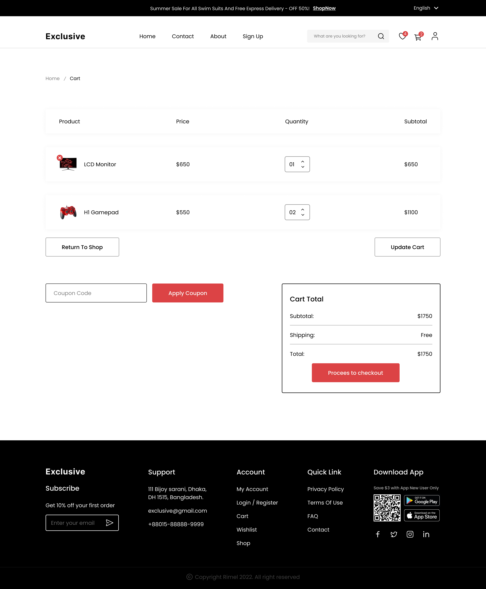
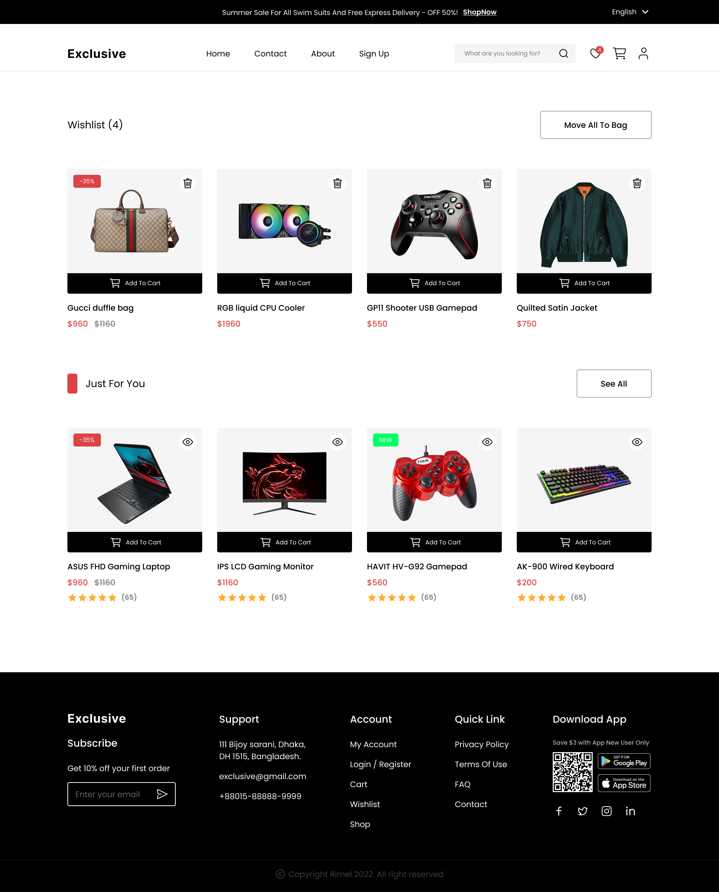

# 🛒 Exclusive – E-commerce Multi-page Frontend Website  

  
  

## 🚀 Live Demo  
🔗 [View Project on Netlify](https://mohamadbiomy-exclusive.netlify.app/)  

---

## 📖 About the Project  
**Exclusive** is a fully responsive **frontend e-commerce website** built with **HTML, TailwindCSS, and Vanilla JavaScript**.  
The project demonstrates modern frontend practices, dynamic UI updates, and reusable components — ideal for real-world online store use cases.  

---

## ✨ Features  
- 🔹 **11 Different Pages** → Structured to cover all e-commerce flows  
- 🔹 **Fully Responsive** → Works seamlessly across mobiles, tablets, and desktops  
- 🔹 **Shopping Cart & Favorites** → Instant updates when adding/removing items  
- 🔹 **Dynamic Product Pages** → Content changes based on the selected product  
- 🔹 **Products from JSON** → Easy to update, extend, or connect to an API later  
- 🔹 **localStorage Support** → Cart and favorites are saved between visits  
- 🔹 **Reusable Components** → Shared header, footer, and UI elements  
- 🔹 **Form Validation** → For login, sign-up, and checkout pages  

---

## 🛠️ Built With  
- **HTML5**  
- **TailwindCSS**  
- **Vanilla JavaScript**  

---

## 🎨 UI Design  
The UI is based on an open-source design in Figma by **MD Rimel** →  
[👉 Full E-commerce Website UI/UX Design](https://www.figma.com/community/file/1219312065205187851/full-e-commerce-website-ui-ux-design)  

---

## 🤝 Contributing  
This project is mainly for learning and portfolio purposes.  
Feel free to fork, improve, or share feedback.  

---

## 📬 Contact  
👨‍💻 Mohamed Biomy  
🔗 [LinkedIn](https://www.linkedin.com/in/mohamad-biomy-29329a374/)  
🌐 [Portfolio](https://mohamadbiomy.netlify.app/)  

---

## 📸 Screenshots  

### 🏠 Home Page  
  

### 📄 Product Details  
  

### 🛒 Shopping Cart  
  

### 💖 Wishlist  
  

---

## 💡 How to Run Locally  
```bash
# Clone the repo
git clone https://github.com/yourusername/exclusive-ecommerce.git

# Open index.html in your browser (no build tools needed)
